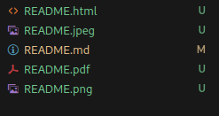

# Rapport d'Audit de Pentest
- [x] #739
- [ ] https://github.com/octo-org/octo-repo/issues/740
- [ ] Add delight to the experience when all tasks are complete :tada:

## Table des Matières

1. [Introduction](#introduction)
2. [Objectifs de l'Audit](#objectifs-de-laudit)
3. [Méthodologie](#méthodologie)
4. [Résumé Exécutif](#résumé-exécutif)
5. [Résultats Détailés](#résultats-détaillés)
    - [Vulnérabilités Critiques](#vulnérabilités-critiques)
    - [Vulnérabilités Elevées](#vulnérabilités-élevées)
    - [Vulnérabilités Moyennes](#vulnérabilités-moyennes)
    - [Vulnérabilités Faibles](#vulnérabilités-faibles)
6. [Recommandations](#recommandations)
7. [Conclusion](#conclusion)
8. [Annexes](#annexes)

 
\pagebreak 

## Introduction

Cet audit de pentest a été réalisé dans le cadre d'un entretien d'embauche pour le poste de pentesteur chez Orange Cyber Defense. L'objectif principal est de démontrer mes compétences en matière de sécurité informatique et d'évaluation des vulnérabilités. Cet audit est une simulation pratique visant à identifier et évaluer les vulnérabilités au sein d'une infrastructure prédéfinie. Les résultats obtenus permettront de mettre en évidence mes capacités à mener des tests de pénétration approfondis et à fournir des recommandations de sécurité pertinentes.

## Objectifs de l'Audit

Décrivez les objectifs principaux de l'audit de pentest, par exemple :

- Identifier et évaluer les vulnérabilités de sécurité présentes dans l'infrastructure.
- Fournir des recommandations pour remédier aux vulnérabilités identifiées.

## Méthodologie

Expliquez la méthodologie utilisée pour l'audit, y compris :

- Les outils et techniques utilisés.
- Les phases de l'audit (reconnaissance, analyse de vulnérabilités, exploitation, post-exploitation, etc.).
- L'étendue et les limites de l'audit.

## Résumé Exécutif

Fournissez un résumé des principales découvertes de l'audit. Cette section devrait donner une vue d'ensemble des vulnérabilités critiques et des recommandations clés.

## Résultats Détailés

### Vulnérabilités Critiques

Pour chaque vulnérabilité critique, fournissez les informations suivantes :

- **Identifiant de la Vulnérabilité :** CVE-XXXX-XXXX (si applicable)
- **Description :** Décrivez la vulnérabilité.
- **Impact :** Expliquez l'impact potentiel sur l'organisation.
- **Preuve de Concept :** Fournissez des exemples ou des captures d'écran.
- **Recommandations :** Conseils pour remédier à la vulnérabilité.

### Scénario d'exploitation

#### Compromission de la machine <IP>

>git log git status git show ⇒ trouver compte admin ⇒ RCE ⇒ leenpeas ⇒ USER ⇒ ROOT

`Expliquer le cheminement global. (Ne pas hésiter a faire des réference)`

### Vulnérabilités Elevées

#### SQLI

Nous avons trouvé une injection SQL su le paramêtre <>

##### Remédiation 

Il faudrait utilisé les PDO et faire des requêtes preparées

#### Exposition de l'historique du code source

Nous avons trouvé dans l'application Web le dossier .git qui contient l'ensemble des commits github du code source.

Ce dossier contenait des Secrets utilisateurs

##### Remédiation 

Ne pas deployer le .git dans les fichiers accèssible en production.

#### LFI

En ce qui concerne la faille LFI,

##### Remédiation 

### Vulnérabilités Moyennes

Même structure que pour les vulnérabilités critiques.

### Vulnérabilités Faibles

Même structure que pour les vulnérabilités critiques.

## Recommandations

Fournissez des recommandations globales pour améliorer la posture de sécurité de l'organisation. Cela peut inclure des conseils sur les politiques de sécurité, la formation des employés, et les améliorations techniques.

## Conclusion

Résumez les principales conclusions de l'audit et réitérez les recommandations clés. Mentionnez les prochaines étapes possibles pour l'organisation.

## Annexes

Incluez ici toute information supplémentaire pertinente, comme des logs, des scripts utilisés, des diagrammes de réseau, etc.

